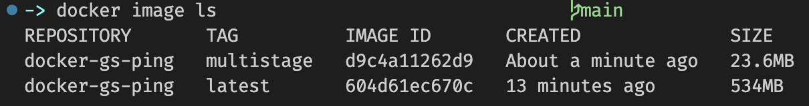

# DockerでGoを動かす
## 1. Step.1 要件と道筋
1. マルチステージングビルドを使用する
2. 動かすプログラムは「REST API」

#### 1-1. 参考にするサイト
[Build your Go image](https://matsuand.github.io/docs.docker.jp.onthefly/language/golang/build-images/)を元に環境構築を行っていきます。

- 理由としては以下になります。
1. 公式ドキュメント
2. サンプルアプリケーションがRESTである要素
3. マルチステージへの導線

## 2. Dockerfile
**Dockerイメージを取得する命令を含んだテキストファイルのこと**。
Dockerに対して`docker build`コマンドを実行してイメージビルドを指示すると、Dockerは記述された命令を読み込んで実行し、最終的にDockerイメージを作り出す。

#### 2-1. Dockerfileをもう少し詳しく
- Dockerfileに対して用いられるデフォルトのファイル名は、`Dockerfile`という名前そのままです。
※ファイル拡張子はない(`.go`, `.py`などのこと)
この名前を用いておければ、`docker build`というコマンドを実行する際に、コマンドラインフラグ(オプションのような`-l`などのこと)を追加して指定する必要がない。

- プロジェクトによっては特定の目的のためにDockerfileに別名を与える場合がある。
慣例として、`Dockerfile.<something>`や`<something>.Dockerfile`とする。(somethingにName)このように名前を付けたDockerfileは、`docker build`コマンドの実行に際して`--file`オプション(短縮系`-f`)を用いて指定する。
**基本的にはデフォルト名の`Dockerfile`を用いる事が推奨されている。**

## 3. Dockerfileを書いてみる
実際に書きながら何を意味しているかを確認しながら進めていきます。

まず、プロジェクトのルートディレクトリに`Dockerfile`という名前のファイルを生成し、テキストエディタで開きます。

## 3-1. パーサーディレクティブ
1行目に書くのは`# syntax`パーサーディレクティブです。
以下のように書きます。
```docker: dockerfile
# syntax=docker/dockerfile:1
```
`docker/dockerfile:1`と記述することで、"**常に文法バージョン1の最新リリース版を指し示す**"ことになります。これが推奨されています。

主な特徴は2点
- **任意の記述**ではある。
- 記述する場合は第一に(Dockerfileの一番最初に)記述する事が必要である。

このパーサーディレクティブと呼ばれる記述が何を意味するかというと、Dockerfileの解析にあたってDockerビルダーがどの文法を採用するのかを指示する目的があります。

最初見た何だこれはと思って調べる時に[同じような疑問を持つ人の質問](https://qiita.com/yosaku_ibs/questions/050167327149837d6c5d#answer-884a349811b3ef1cce11)がありました。
Windowsに対応できるように指示したり、ヒアドキュメントというものを使えるようにするために記述したり出来るようです。

**補足**: Buildkit
[参考: Buildkit](https://genzouw.com/entry/2021/07/17/100615/2724/)
Buildkitは、**ビルド処理の前に文法に更新がないかを自動的にチェックし、最新バージョンが用いられていることを確認します**。
最新のDocker環境を利用している限り既に有効になっているようですので、あまり気にしなくても良いですが、パーサーディレクティブと関係はあります。
最新ではないDocker環境の場合、Buildkitが有効になっていない場合があります。その場合はパーサーディレクティブを記述することでビルド前にパーサーをアップグレードするようになります。

#### 3-2. ベースとなるイメージの指定
次に、アプリケーションに使用する基本イメージをDockerに伝える行を追加する必要があります。
Dockerイメージは他のイメージから継承ができます。(既存のイメージを使用できるということ。)
これはオブジェクト指向プログラミングのクラス継承と同じように考える事ができます。

以下は、公式のGoイメージを使用しています。
```docker: dockerfile
FROM golang:1.16-alpine
```
このように`FROM ~`と記述します。
`FROM`はベースとなるイメージを指定し、Dockerfileの先頭(#syntaxの後)に必ず必要です。

この最初の`FROM`の後に続くコマンドはすべて、ここで指定した「ベースイメージ」の上に構築されます。

#### 3-3. ディレクトリの作成
FROM以降に書くコマンドを簡単に実行するために、構築中のイメージ内にディレクトリを作成する。
`WORKDIR </ディレクトリ名>`と記述します。
ここでは`app`と名付けます。

```docker: dockerfile
WORKDIR /app
```
このようにディレクトリを作成すると、このディレクトリを基点としてコマンドを記述する事ができます。この場合、作成したディレクトリに基づく相対パスが使用できます。

#### 3-4. ファイルをイメージにコピー
通常、Goで記述されたプロジェクトをダウンロードして最初に行うことはコンパイルに必要なモジュールをインストールすることです。
しかし、イメージ内でそれを実行するには先にファイルをイメージにコピーする必要があります。

コピーするのは`go.mod`, `go.sum`の2つです。
詳細は[こちら](https://blog.framinal.life/entry/2021/04/11/013819#gomod%E3%81%A8%E3%81%AF)

```docker: dockerfile
COPY go.mod ./
COPY go.sum ./
```
`./`は`WORKDIR`で作成したディレクトリから見た相対パスです。つまり`/app`ディレクトリにコピーすることを指しています。

#### 3-5. ビルド時に実行するコマンドの指定
次に記述するのは`RUN`コマンドです。
`RUN`は**ビルド時に実行するコマンドを指定します**。
- ビルド(build)
> ソースコード上に問題がないかどうかを解析を行った上で、問題がなければオブジェクトコードに変換し、複数のオブジェクトファイルを1つにまとめて実行可能なファイルを作成する作業を指します。
簡単に言うと、プログラムの元ネタから実際のプログラムを作る作業工程のことです。

今回ビルドしたイメージ(Go 公式)にはモジュールファイルがあるので、それを実行するように指定します。

ローカルで実行した場合と全く同じように機能しますが、今回のコマンドは、Goモジュールがイメージ内のディレクトリにインストールされることを意味します。

```docker: dockerfile
RUN go mod download
```

#### 3-6. ソースコードをイメージにコピーする
```docker: dockerfile
COPY *.go ./
```
`COPY *.go`が意味するのは、"ワイルドカード"を用いて、ホスト上の現在のディレクトリ(Dockerfileがあるディレクトリ)にある拡張子が`.go`である全てのファイルを、イメージ内のカレントディレクトリにコピーすることを意味しています。

#### 3-7. アプリケーションのコンパイル
次に、`RUN`コマンドを用いて、アプリケーションのコンパイルを行います。

```docker: dockerfile
RUN go build -o /docker-gs-ping
```
おさらいですが、`RUN`はビルド後に実行するコマンドを指定することを意味します。
つまり、ビルド後に`go build -o /docker-gs-ping`を実行するということです。

`go build -o /docker-gs-ping`の`-o`の意味があやしいですが、[go documentation](https://pkg.go.dev/cmd/go#hdr-Compile_and_run_Go_program)の"go test"の項目に`-o`について書いてあったので引用すると、
> `-o <file>`
> バイナリを指定されたファイルにコンパイルします。
とあります。
つまり、コンパイルした後のファイル名を"docker-gs-ping"として配置するという意味と捉えられます。

**コンパイルされた"docker-gs-ping"というファイルはDockerが実行できる状態になった**ということが重要です。

配置場所は構築中のイメージのファイルシステムのルートです。
ルートディレクトリ(配置場所)に特別な意味はないが、ルートに配置することで読みやすさ、ファイルパスが短くなるため、便利です。

#### 3-8. ポート番号
公式の方には書いてない(意図不明)ですが、完成コードには`EXPOSE 8080`が記述されています。

`EXPOSE`は指定したポート番号をコンテナが公開することをDockerに伝えるという意味があります。

#### 3-9. docker run時に実行するコマンド
最後にコンパイルした"docker-gs-ping"ファイルをコンテナを起動する時に実行するコマンドとしてDockerに指示を出す文を記述します。

```docker: dockerfile
CMD [ "/docker-gs-ping" ]
```

#### 3-10. 完成したDockerfile
完成したDockerfileが以下です。
```docker: dockerfile
# syntax=docker/dockerfile:1

FROM golang:1.16-alpine

WORKDIR /app

COPY go.mod ./
COPY go.sum ./
RUN go mod download

COPY *.go ./

RUN go build -o /docker-gs-ping

EXPOSE 8080

CMD [ "/docker-gs-ping" ]
```

#### 3-11. Comments
Dockerfileには`#`を使用してコメントを書く事ができます。

必ず行頭に`#`を付けて記述します。
コメントはDockerfileを文書化するために便宜的に存在します。

※syntaxディレクティブが存在する場合はこのディレクティブの後に書きましょう。syntaxディレクティブは全てにおいて最優先されます。

- コメント例
```docker: dockerfile(comments)
# syntax=docker/dockerfile:1

# Alpine is chosen for its small footprint
# compared to Ubuntu
FROM golang:1.16-alpine

WORKDIR /app

# Download necessary Go modules
COPY go.mod ./
COPY go.sum ./
RUN go mod download

# ... the rest of the Dockerfile is ...
# ...   omitted from this example   ...
```

#### 3-12. イメージのビルド
公式の冒頭でサンプルアプリケーションのクローンが促されています。
今回作成したDockerfileも[サンプルアプリケーション](https://github.com/olliefr/docker-gs-ping)にあります。

※自分は理解していなかったのですが、
```docker: dockerfile
COPY go.mod ./
COPY go.sum ./
```
この記述はプロジェクトディレクトリに`go.mod`ファイル、`go.sum`ファイルがあり、それをコピーするという意味です。

なので、公式のDockerfileはサンプルアプリケーションをクローンしてある前提でした。

```code:
$ git clone https://github.com/olliefr/docker-gs-ping
```

- クローンしたファイル内(ディレクトリ内のルート)で以下のコマンドを実行
```code:
$ docker build --tag docker-gs-ping .
```
エラーがなければ`FINISHED`と出ます。

`--tag`は、ビルドしたイメージにラベルを付け、読みやすく認識しやすい文字列値で表示できます。
もし`--tag`を付けない場合は、デフォルト値として`latest`が使用されます。

無事にイメージをビルドできたら、`$ docker image ls`と打ち、作成したイメージを見てみましょう。
REPOSITORY名が`docker-gs-ping`という名前で作成できているのが確認できます。

## 4. マルチステージビルド
[サンプルアプリケーション](https://github.com/olliefr/docker-gs-ping)には、`Dockerfile.multistage`という名前のファイルがあります。
これがマルチステージビルドされた`Dockerfile`です。

```docker: dockerfile(multistage)
# syntax=docker/dockerfile:1

##
## Build
##
FROM golang:1.16-buster AS build

WORKDIR /app

COPY go.mod ./
COPY go.sum ./
RUN go mod download

COPY *.go ./

RUN go build -o /docker-gs-ping

##
## Deploy
##
FROM gcr.io/distroless/base-debian10

WORKDIR /

COPY --from=build /docker-gs-ping /docker-gs-ping

EXPOSE 8080

USER nonroot:nonroot

ENTRYPOINT ["/docker-gs-ping"]
```

#### 4-1. マルチステージビルドでイメージのビルド
最初にイメージのビルドを行った階層で行います。
```code:
$ docker build -t docker-gs-ping:multistage -f Dockerfile.multistage .
```
TAGの名前に意味はなく、比較の為に`multistage`と付けています。
`-f`でビルドに用いるファイルを指定します。(Dockerfile.multistageというファイル名のためです。)

- `docker image ls`


注目すべきはSIZEです。
**SIZEが桁違いに違います**。

#### 4-2. Dockerfile(マルチステージ)
マルチステージを行うDockerfileの記述を確認します。

1. `FROM golang:1.16-buster AS build`
`golang:1.16-buster`は、Golangの最新devianパッケージの構成という意味のようです。
どういったバージョンを使うか、を指定するとだけ覚えておけばOKです。
`AS build`で別名を付けてます。ここも重要なポイントです。
この別名は後で効いてきます。

2. `FROM gcr.io/distroless/base-debian10`
`distroless`は、Googleが提供している必要最小限の依存のみが含まれるコンテナイメージのことです。
他詳細 -> [コンテナイメージ使うならdistrolessもいいよねという話](https://zenn.dev/yoshii0110/articles/21ddb58c6f6bfa)

3. `COPY --from=build /docker-gs-ping /docker-gs-ping`
注目すべきは`--from=build`です。ここの`build`という名前は1の別名を指しています。
つまり、1つめのビルドステージのイメージを参照し、実行に必要な`docker-gs-ping`のバイナリだけをピンポイントでコピーしているということです。

4. `ENTRYPOINT ["/docker-gs-ping"]`
`ENTRYPOINT`は、`docker run`時に実行するコマンドを指定します。
> CMD と似てますが、「--entrypoint オプション > ENTRYPOINT > run引数 > CMD」の優先度があります。

#### 4-2. Dockerfileの書き方の違い
- マルチステージビルドの良い所
1. `FROM`を複数回書ける
> `FROM`を2回書く事自体は既にできていたようです。
> 中間イメージを`AS`で名前を付け、それを直接参照できることが新しくできるようになったことです。

以前は複数のDockerfileを組み合わせたりしていた事を1つのDockerfileだけで済むようになった。
`AS`で中間イメージを作り、それを用いて行う。

2. 打ち間違い、可読性の向上
以前は無理に`&&`や`\`を使ってコマンドを繋げていたことをしなくて良くなる。
Dockerfile自体も見やすくなりますし、打ち間違いも減ります。

3. SIZEが大幅に軽量になる
最初にSIZEを比べましたが明らかにマルチステージビルドの方が軽量です。

おおまかにはこの辺りが利点として挙げられます。

## 5. イメージの実行
イメージのビルドがゴールではありません。
次に、ビルドしたイメージを実行します。
コンテナ内でイメージを実行するには`docker run`コマンドを使います。
このコマンドは、1つの"**イメージ名**"を引数に必要とします。

```shell:
$ docker run docker-gs-ping
```

```shell:
   ____    __
  / __/___/ /  ___
 / _// __/ _ \/ _ \
/___/\__/_//_/\___/ v4.2.2
High performance, minimalist Go web framework
https://echo.labstack.com
____________________________________O/_______
                                    O\
⇨ http server started on [::]:8080
```

これが見えたら成功です。
打ち込んだ後、入力状態には戻りません。戻る為にはコンテナを停止させる必要があります。

```code:
$ docker run -d docker-gs-ping
```

`⇨ http server started on [::]:8080`
となっているので`curl`を用いてポート8080にデータを送ってみます。

```shell:
$ curl http://localhost:8080/

# 実行結果
# curl: (7) Failed to connect to localhost port 8080 after 8 ms: Connection refused
```
公式によると、この出力は期待通りのようです。
> **コンテナはネットワークも含めた隔離された環境内で実行されているから**
ということです。

今度は同じ`docker run`をポート8080を公開した上で再起動します。
一度コンテナを停止します。

## 5-1. 起動: フォアグラウンドとバックグラウンドの違い
```shell:
# フォアグラウンドでの起動
# 起動させたターミナルでは起動状態でコマンドを受け付けない
$ docker run docker-gs-ping

# バックグラウンドでの起動
# 起動させたターミナルは起動後も使用できる
$ docker run -d docker-gs-ping
```
この違いは何でしょうか？
自分は便利だからバックグラウンドでいいやーとか思ってたのですが、両者の違いやメリットが存在しました。

1. フォアグラウンドではレスポンスが見れる
`curl`など、通信を行った際にレスポンスコード(200, 300など)が見れます。
開発環境ではこれらを確認しながら開発を進めるのが便利のようです。
起動させた後は別のターミナルを開いて、そちらでターミナルコマンドを実行します。

2. バッググラウンドの用途
どちらかというと開発後の用途になります。
もうサーバーとの状態をフォアグラウンドで確認しなくても良いので、実際のプロダクトはバックグラウンドで起動させます。

#### 5-2. ポートを公開し、通信をやり取りする
```shell:
$ docker run -d -p 8080:8080 docker-gs-ping
# 起動したコンテナIDが表示されます。
# docker ps または、DockerDesktopで起動を確認してみてください。

$ curl http://localhost:8080/
# Hello, Docker! <3 と返ってきます。
```
これは[サンプルアプリケーション](https://github.com/olliefr/docker-gs-ping)の`main.go`の以下が返ってきていました。

```go: main.go
e.GET("/", func(c echo.Context) error {
		return c.HTML(http.StatusOK, "Hello, Docker! <3")
	})
```

#### 5-3. コンテナに名前を付ける
`docker run`後に作成されたコンテナ名(NAMES)はランダムで付けられます。
この名前を用いて再起動や削除を行います。
名前は`docker ps`で確認出来ますが、もし面倒だったり任意の名前を付けたい場合は`--name`オプションを用います。
```shell:
 docker run -d -p 8080:8080 --name rest-server docker-gs-ping
```
このように指定すると、NAMESが"rest-server"という名前でコンテナが作成されます。

**※この章のコンテナの一覧表示、削除、起動、などは割愛します。**

#### 5-4. ふとした疑問
ここで立ち上げたコンテナってマルチステージビルドのイメージなの？という疑問が沸きました。

一度コンテナを全部削除して、イメージもマルチステージを残して削除します。
その後、`docker run`を実行します。

```shell:
$ docker run -d -p 8080:8080 docker-gs-ping

# 以下にエラー文が出力されます。
# Unable to find image 'docker-gs-ping:latest' locally
# docker: Error response from daemon: pull access denied for docker-gs-ping, repository does not exist or may require 'docker login': denied: requested access to the resource is denied.
# See 'docker run --help'.
```

その後付けたタグを指定して実行すると成功します。
```shell:
$ docker run -d -p 8080:8080 docker-gs-ping:multistage

# コンテナIDの出力
```
マルチステージのタグを付けてイメージを作成していたので、デフォルトの`docker run`は`latest`を参照するのかなという推察です。
タグ名を付けてイメージを作成した場合は明示的に指定する必要があると思われます。

## 6. データベースエンジン
公式の次の手順は、以下です。
1. データベースエンジンを実行し、これをさプルアプリケーションに接続。
2. `Docker Compose`を使用して複数コンテナの管理

#### 6-1. 使用するデータベースエンジン
[CockroachDB](https://www.cockroachlabs.com/product/)と呼ばれ、最新のクラウドネイティブの分散型SQLデータベースです。
CockroachDBのDockerイメージを使用します。

#### 6-2. ストレージ
データベースの重要な点は、**データの永続的な保存を行うこと**と表記してます。

この言い回しは、コンテナのサイクルと関係があります。
コンテナ内で発生したデータは同じコンテナ内のどこかに書き出されるが、コンテナを破棄すると消えてしまいます。
コンテナは生成->削除がある意味1セットな考え方、手軽さがありますので、コンテナにおいてデータを永続的に保存したい場合は"ボリューム"というメカニズムを利用します。

ボリュームの作成には次を実行します。
```shell:
$ docker volume create roach
# roach
```

ボリュームのリストの表示
```shell:
$ docker volume list
# DRIVER    VOLUME NAME
# local     roach
```

#### 6-3. ネットワークの構築
サンプルアプリケーションとデータベースエンジンは、ネットワークを介して相互に通信を行います。
さまざまな種類のネットワーク構成が可能で、ユーザー定義ブリッジネットワークと呼ばれるものを使用します。

```shell:
# -dはネットワークを管理するドライバーを指定するオプション
$ docker network create -d bridge mynet
# NETWORK ID
```
- `docker network create`でブリッジネットワークが作成されます。
- ブリッジネットワークは仮想ブリッジを使用する。
(ブリッジはOSI参照モデルのデータリンク層における通信を制御する)
- ユーザーが作成したブリッジネットワークをユーザー定義ブリッジネットワークと呼ぶ。

ネットワークを一覧表示して確認する
```shell:
$ docker network list

# NETWORK ID     NAME      DRIVER    SCOPE
# 96bd8ddeb5bb   bridge    bridge    local
# 620d216e0654   host      host      local
# c49f4a66c445   mynet     bridge    local
# e1be2f472332   none      null      local
```
mynet以外に3つありますが、これはDocker自体によって作成されている。
詳細: [ネットワークの概要](https://matsuand.github.io/docs.docker.jp.onthefly/network/)に、今回作成された<NAME>で見ると何であるか確認出来ます。

#### 6-4. 適切な名前付け
- コンピュータサイエンスで難しいと言われている事が2つ
1. キャッシュの無効化と名前付け
2. [Off-by-one-Error](https://ja.wikipedia.org/wiki/Off-by-one%E3%82%A8%E3%83%A9%E3%83%BC)

ネットワークおよび管理ボリュームの名前は、意図した目的を示す名前を付ける事が推奨されている。

#### 6-5. データベースエンジンの起動
ここまでの一通りの作業が終わると、CockroachDBをコンテナで実行し、先ほど作成したボリュームとネットワークに接続できるようになりました。

以下のコマンドを実行すると、DockerがDocker Hubからイメージを取得してローカルで実行してくれる。
```shell:
$ docker run -d \
  --platform linux/x86_64 \
  --name roach \
  --hostname db \
  --network mynet \
  -p 26257:26257 \
  -p 8080:8080 \
  -v roach:/cockroach/cockroach-data \
  cockroachdb/cockroach:latest-v20.1 start-single-node \
  --insecure

# ... output omitted ...
```
- M1Macの人は
公式通りにコマンドを打つとエラーになります。
原因はM1Macによるものです。
明示的にplarformを指定する必要があります。
`--platform linux/x86_64 \`の行です。

#### 6-6. データベースエンジンの設定
アプリケーションでの使用を開始する前に行わなければいけない設定が幾つかあります。
コンテナに入り、SQLコマンドを用いて行います。これはCockroachDBの組み込みSQLシェルの機能です。

```shell:
$ docker exec -it roach ./cockroach sql --insecure
# root@~ のようにSQLコマンドを受け付ける状態になる
```

1. 空のデータベースの作成
```sql:
CREATE DATABASE mydb;
```

2. データベースエンジンに新しいユーザーアカウントを登録
```sql:
CREATE USER totoro;
```
"totoro"は任意です。

3. 新しいユーザーにデータベースへのアクセス権の付与
```sql:
GRANT ALL ON DATABASE mydb TO totoro;
```

4. `quit`と入力し、シェルの終了

#### 6-7. この先動かすサンプルアプリケーション
ここから使用するサンプルアプリケーションは、これまでに使用してきた"docker-gs-ping"を拡張したものになります。
- 拡張するには
1. ローカルにコピーしたものを更新する
2. [拡張済みのもの](https://github.com/olliefr/docker-gs-ping-roach)をクローンして使用する
公式では2を推奨していますので、倣ってクローンします。
(docker-gs-pingとは違うディレクトリが良いでしょう。)
```shell:
$ git clone https://github.com/olliefr/docker-gs-ping-roach.git
# ... output omitted ...
```
"docker-gs-ping-roach"というディレクトリがクローンされました。

- 拡張後の変更点
`main.go` ->
データベースの初期化コードと新しいビジネス要件を実装するコードの追加

拡張後のDockerfileを見ると、マルチステージビルドに対応した記述がされていますね。
`FROM gcr.io/distroless/base-debian10`
ここを調べると、ポイントは"distoless"のようです。

ベースとしてディストリビューションにはカーネルを除く基本的な設定ファイルやパッケージが一通り含まれているので、こうした**不要なファイルを削除し、アプリケーションの実行に必要な最小限のファイルのみを含んだコンテナイメージ**をビルドすることを意味しています。

#### 6-8. アプリケーションのビルド
- アプリケーションのビルド
```shell:
$ docker build --tag docker-gs-ping-roach .
```
#### 6-9. アプリケーションの実行
まず、アプリケーションがデータベースへのアクセス方法が認識できるように、いくつかの環境変数を設定する必要があるようです。
`docker run`コマンドを用いて行います。

```shell:
$ docker run -it --rm -d \
  --network mynet \
  --name rest-server \
  -p 80:8080 \
  -e PGUSER=totoro \
  -e PGPASSWORD=myfriend \
  -e PGHOST=db \
  -e PGPORT=26257 \
  -e PGDATABASE=mydb \
  docker-gs-ping-roach
```

以下のコマンドが実行できればOKです。
```shell:
$ curl localhost
# Hello, Docker! (0)

# または、
$ curl http://localhost/
# Hello, Docker! (0)
```
DockerDesktopなどで確認すると分かりますが、`-p 80:8080 \`でホストポートを80にしています。
ポート80は**WebサーバがHTTPでWebブラウザなどと通信するために**用いられています。

出力された`(0)`はメッセージの合計数です。アプリケーションにはまだ何も投稿していないので問題ありません。

