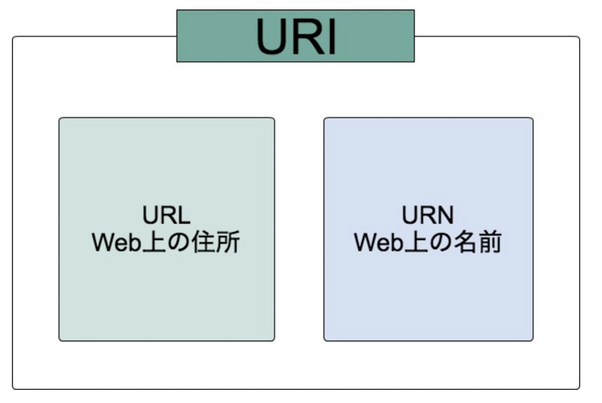

# DockerでGoを動かす
## 1. 要件
1. マルチステージングビルドを使用する
2. 動かすプログラムは「REST API」

## 2. REST API
#### 2-1. RESTとは何か？
**シンプルなWebシステムの設計思想**のこと

**RE**presentational **S**tate **T**ransfer
(リプレゼンテーショナル・ステイト・トランスファー)
の略で、
- REpresentational -> 具象化された
- State -> 状態
- Transfer -> 転送

つまり、「**具体的に状態を定義した情報のやり取り**」のような意味合いで受け取れます。
また、REST APIとRESTful APIは広義ではほぼ同じと考えて問題ないのでここは深掘らないことにする。

#### 2-2. REST APIを使うと何がいいのか
REST APIとは、リソースが持つURIの適切な処理・運用が重要な部分です。これによって得られるメリットが以下のような点です。
(リソース、URIなどは後ほど詳しく書いていきます。)

1. URI(後述)に規律が生まれることで、APIを利用するサービス開発者が楽になり、開発者自身もURIから直感的に情報が取得しやすくなる。

2. ブラウザのアドレスバーにURIを入力すればリソースが参照できる。

3. ステートレスな特徴があり、負荷に応じたスケーラビリティが向上する。(負荷軽減)**1番のメリット**

4. HTTP標準のメソッド(GET, POST...)を使う事で、シンプルで一貫性のあるリクエスト標準化が円滑に行える

#### 2-3. リソース指向アーキテクチャ(ROA)
調べていくうちに以下の一文が目に留まりました。

**ROAはRESTful APIを実装する上で問題を解決してくれるアーキテクチャでもある。言い換えるとRESTful APIはROAの実装ということになる(ROAに則りRESTful APIは実装されている)**

冒頭でも書きましたが、RESTというのはあくまでも**思想設計**であるということで、RESTアーキテクチャというものが存在するわけではありません。
よく目にするのが**RESTの4原則**です。

個人的にはROAの概念と特性を実装することでRESTful APIが実装できると考えた方が自然でした。

#### 2-4. ROAとは
**それ自体を参照するに値するもの**を「リソース」として定義し、リソースを中心に考えるアーキテクチャのこと。
- リソースという概念
- リソースはURIを持つ
- リソースに対する操作
- リソースの表現形式
というように、ROAの中心はあくまでリソースになる。

[RESTful Webサービス](https://www.oreilly.co.jp/books/9784873113531/)で初めて提唱された。

## 3. ROAの4つの概念
1. リソース
2. 名前(URI)
3. 表現
4. リソース間のリンク

#### 3-1. リソース
**Web上に存在する情報、データのこと**
リソースという言葉自体で調べると、「資源全般を指すが、さらに**目的達成に必要な要素、役に立つ要素のこと**」を指しています。

リソースは名詞で定義される。
リソース自体を参照するに値するほどの重要性を持っている。
例えば: ドキュメント、データベースの行など, 以下リソース例
- ソフトウェアリリースのバージョン(1.0.3のような数値)
- 猫に関する情報
- 天気予報
- 1024の次の素数

### 3-2. URI

ざっくり、URI ≒ URL, URI ≒ URNと捉えておきます。

リソースは少なくとも1つのURIを持っていなければならない。なぜならリソースはURIを通じて提唱されるから。

**URIを持たない情報はリソースではない**
URIを持たない情報は他のリソースを説明するただのデータ。

- URIを持つリソースのイメージ
広告にURIを掲載する。その広告を見た人がブラウザにURIを打ち込む。そうすると広告主が表示したいと考えていたリソースが表示される。

#### 3-2-1. URIは記述的であるべき
**URIとリソースは直感的に対応させた方が良い**
さらに、**URIは構造的で、かつその構造は予測可能な方法で区別されること**が好ましい。

- 良くない例
1. 猫の情報を調べる
`/search/cat`にアクセスする
2. ネズミについて調べる
`/i-want-to-know-about/Mice`にアクセスする

このようにURIの名前に統一間がなく、直感的ではない。
猫で`/search/cat`にしたのなら、ネズミでも`/search/mouse`とするべきである。

#### 3-2-2. URIとリソースの関係
**定義上**、2つのリソースが同じであることはありえない。
あるとすれば、2つの異なるリソースが同じデータをポイントすること。

1. `/software/releases/1.0.3.zip`
2. `/software/releases/latest.zip`
このように、上の2つはしばらくの間は同じファイルを指している。(latest -> 最新の)
しかし、この2つのURIの目的は異なる。
1は常に`1.0.3`というバージョンを指すのに対して、2はクライアントがアクセスした時点での最新バージョンをポイントする。つまり、2はある段階で1を指すことではなくなるということ。

この場合、これは2つが同じリソースだ！とならない。1つのリソース(ここでいう1)に2が結びついたという事と捉える。

リソースはURIを1つ以上持つ事ができるために、起こる事で、結びつくURIが増えるたびにURIの価値が希薄化する。
これを回避する方法の1つが、**1つを正規URIにし、正規URIに結びつくURIはサポートするもの**とすることです。

例えば、クライアントが正規URIをリクエストしたら200(OK)とともに適切なデータを送る。
正規でないURIにリクエストしたら正規URIととともに303(See Other)を送信する。
こうすることで正規URIにリダイレクトさせることができる。

### 3-3. 表現
Webサーバは特定の言語(英語, 日本語...)、フォーマット(HTML, XML, JSON...)で送信しなければならない。
こういったリソースの形式をリソースの表現と呼ぶ。

#### 3-3-1. 表現の選択
サーバがリソースの表現を複数提供する場合、クライアントが要求している表現をどのようにして判断するのか？問題が発生する。
最も簡単でROA的に推奨されているのは、**リソースの各表現に個別のURIを割り当てること**
例えば、リソースが英語とスペイン語で提供されている場合
- 英語のURI
  - `/resource.en`
- スペイン語のURI
  - `/resource.es`
のように、それぞれ個別のURIを割り当て、クライアントにアクセスしてもらう方法が推奨される。
これは、サーバがリクエストを処理するために必要な情報がすべてURIに含まれているからである。

ただし、この方法は同じリソースなのにURIだけ見ると別のリソースを指示しているように見えるという欠点がある。この解決策としてコンテンツネゴシエーション(説明割愛)が存在する。
コンテンツネゴシエーションを利用することで、
`resource`
というURIだけで様々な言語やフォーマットのリソースを提供することが可能となる。

#### 3-4. リソース間のリンク
**リソースには別のリソースへのリンクを含め事ができる**。リンクを含めることで別のリソースに接続することができる。
このような性質のことを「**接続性**」と呼ぶ。
従来のWebが使いやすいのは、リソース同士が適切に接続されているからである。

### 3-5. リソースの概念のまとめ
- リソースとはデータそのもののことではあるが、データ自体に意味があり、参照するに値するもののことを指す
- リソースはURIを持つ。URIを持たないものはリソースとは呼ばない。ただのデータである。
- リソースは、クライアントの状況、要望に合わせて提供されるものである。
- リソースは、他のリソースへのリンクを含める事ができる。この性質があるからこそ、今のWebが使いやすいものとなっている。

## 4. ROAの4つの特性
良くRESTの4原則と言われるもの。
1. アドレス可能性
2. ステートレス性
3. 接続性
4. 統一インターフェース

### 4-1. アドレス可能性
- アドレス可能性とは
「**URIを通じてリソースを簡単に指し示せる性質のこと**」
ちょっと言葉が難しいので噛み砕くと...
リソース全てがURIを持ち、リソースが提供できる情報をURIで表現できることです。
URIだけの情報から何を示しているのか分かるというと理解しやすい気がします。
例: `https://weathernews.jp/s/forecast/?area=TOKYO`
このURIだけで
- 天気情報
- 東京都
という情報が分かり、東京都の天気予報・情報を示している事が見ただけで推察できます。

### 4-2. ステートレス性
ステートレスとは、状態を保持しない事を指し、ROAでも同じことを指しています。
やや難しい言葉で言うと、「**全てのHTTPリクエストが完全に分離している性質のこと**」を言います。
Cookieなどでセッション管理を行う必要がなく、前のやり取りの結果に影響を受けないのでシンプルに設計できるというメリットがある。

### 4-3. 接続性
リソース間のリンクで述べた内容でもありますが、
「**リソースに含まれるリンクをもとに別のリソースに接続可能となる(遷移可能となる)性質のこと**」です。

### 4-4. 統一インターフェース
統一インターフェースは、
「**リソースの操作をする時に、全てHTTPメソッドが定義通りに使われること**」を言います。
定義通りというのは、あらかじめ定義・共有された方法という意味で、Webであれば`GET, POST ...`のHTTPメソッドでやり取りを行うと定義しているので、これに沿ってリソース操作を行いましょう、ということになります。

例えば、リソースを取得する場合を例に挙げます。
語彙(get)を使って`/getResource`のように記述するのは良くない例です。
`/resource`のようにし、**HTTPのGETメソッド**を利用するのが良い例です。
こうすることで一貫した(**統一された**)インターフェースを保証できます。

- HTTPメソッドは以下の通り
1. GET -> リソースの取得
2. PUT -> リソースの更新
3. POST -> リソースの作成
4. DELETE -> リソースの削除
5. HEAD -> リソースのメタデータの取得
6. OPTIONS -> リソースがサポートするメソッドを調べる

#### 4-4-1. GET -> リソースの取得
クライアントは必要なリソースを取得する場合に、そのURIにGETリクエストを送信してリソースを取得する。
サーバはレスポンスのエンティティボディでリソースを表現し、送信する。
(エンティティボディは簡単にざっくり言うと、HTMLファイルの中身のことです。)

#### 4-4-2. PUT -> リソースの更新
クライアントは不要なリソースを削除する場合に、そのURIにDELETEリクエストを送信してリソースを削除する。
DELETEの場合、レスポンスのエンティティボディはステータスメッセージを含んでいるか、空です。

#### 4-4-3. POST -> リソースの作成

#### 4-4-4. DELETE -> リソースの削除
#### 4-4-5. HEAD -> リソースのメタデータの取得
#### 4-4-6. OPTIONS -> リソースがサポートするメソッドを調べる
