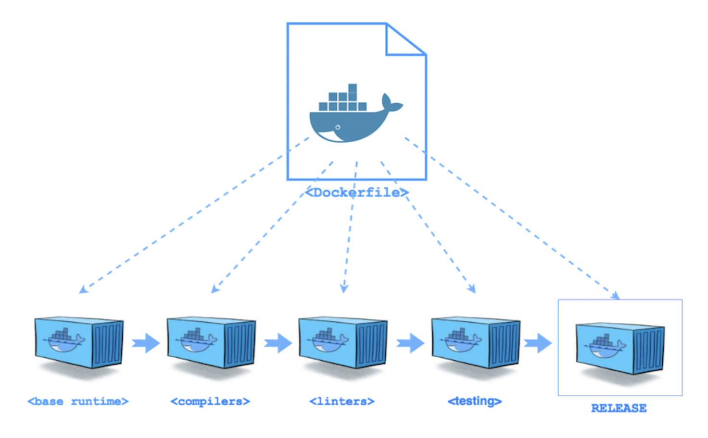

# DockerでGoを動かす
## 1. 要件
1. マルチステージングビルドを使用する
2. 動かすプログラムは「REST API」

## 2. マルチステージングビルド
主参考: [マルチステージビルドの利用](https://matsuand.github.io/docs.docker.jp.onthefly/develop/develop-images/multistage-build/)



#### 2-1. マルチステージングビルドとは
Multi-Staging Build(Multi-Stage Build)
直訳すると、**複数のステージを用いたビルド**

- Docker17.05以上で利用できる新機能
- 可読性・保守性を保ちながらDockerfileを最適化するのに苦労している人の役に立つ

#### 2-2. マルチステージングビルドの目的
- アプリケーションの実行に必要なもののみをビルドすること
そのために複数ステージを用いる

結果、イメージサイズが小さくなり、本番環境の運用のパフォーマンスが向上する

## 3. マルチステージングビルドが生まれた背景
- イメージをビルドする際に取り組む事と言えば、サイズを小さく保ちながらDockerイメージをビルドすること(命題的な意味で)

実際に行っていた事は、**開発用にはアプリケーションのビルドに必要な全てが含まれるDockerfileを使用し**、**プロダクト用にはアプリケーションおよび実行に必要なもののみが含まれるスリム化されたDockerfileを使用する**という事が行われ、**これが非常に一般的だった**。これがいわゆる`ビルダーパターン`(開発パターン)と呼ばれるもの。

しかしこの2つのDockerfilesを保守することは、理想的なやり方ではなかった。

#### 3-1. ビルダーパターン例
上述のビルダーパターンにこだわったやり方の例:

```docker: Dockerfile.build
# syntax=docker/dockerfile:1
FROM golang:1.16
WORKDIR /go/src/github.com/alexellis/href-counter/
COPY app.go ./
RUN go get -d -v golang.org/x/net/html \
  && CGO_ENABLED=0 GOOS=linux go build -a -installsuffix cgo -o app .
```
`RUN`コマンド行では、`&&`を使って2つの`RUN`コマンドを連結しています。
イメージ内に不要なレイヤーが生成されるのを防いでいるが、これでは間違いを起こしやすく、保守もやりづらくなる。
例えば: 別のコマンドを挿入した時に行の継続用の`\`を入れ忘れるなどの事態が容易に発生します。

```docker: Dockerfile
# syntax=docker/dockerfile:1
FROM alpine:latest
RUN apk --no-cache add ca-certificates
WORKDIR /root/
COPY app ./
CMD ["./app"]
```

```docker: build.sh
#!/bin/sh
echo Building alexellis2/href-counter:build

docker build --build-arg https_proxy=$https_proxy --build-arg http_proxy=$http_proxy \
    -t alexellis2/href-counter:build . -f Dockerfile.build

docker container create --name extract alexellis2/href-counter:build
docker container cp extract:/go/src/github.com/alexellis/href-counter/app ./app
docker container rm -f extract

echo Building alexellis2/href-counter:latest

docker build --no-cache -t alexellis2/href-counter:latest .
rm ./app
```
`build.sh`を実行する時、最初のイメージをビルドし、成果物をコピーするためにコンテナを生成し、その後に2つ目のイメージをビルドする必要がある。
**2つのイメージは、それなりに容量をとるもので、ローカルディスク上に`app`の成果物も残ったままになってしまう。**

**こういった状況を非常にシンプルに出来る(解決できる)のが、マルチステージビルドです！**

## 4. マルチステージビルドを利用する
#### 4-1. マルチステージを利用しなかった場合のDockerfileを書き換える
マルチステージビルドでは、Dockerfileで**複数の`FROM`命令を利用する**。
各`FROM`命令は、異なるベースイメージを使うことができ、それを使って新しいビルドステージが開始できる。
あるステージの成果物は、別のステージへコピーする事ができる。

- 前節で示したDockerfileをマルチステージビルドを使ったものに変更する
```docker: Dockerfile
# syntax=docker/dockerfile:1
FROM golang:1.16
WORKDIR /go/src/github.com/alexellis/href-counter/
RUN go get -d -v golang.org/x/net/html
COPY app.go ./
RUN CGO_ENABLED=0 GOOS=linux go build -a -installsuffix cgo -o app .

FROM alpine:latest
RUN apk --no-cache add ca-certificates
WORKDIR /root/
COPY --from=0 /go/src/github.com/alexellis/href-counter/app ./
CMD ["./app"]
```
- どうやってこれが動いているのか
1. 2つめの`FROM`命令は`alpine:latest`をベースイメージとして新たにビルドステージを開始している。
2. `COPY --from=0`は、直前のステージで作り出された成果物を単純に新しいステージにコピーしている。(`from=0`の整数値は、最初の`FROM`命令を0として順次割り振られる)
3. Go SDKと中間イメージは最終的なイメージへは保存されない。

#### 4-2. マルチステージビルドを利用によるメリット
- Dockerfileはただ1つ用意すれば良くなる
  - ビルドスクリプトも個別に用意しなくて良い
  - ビルドするには単に`docker build`を実行するだけ

- 複雑さ、面倒さがなくなる
  - 中間的なイメージを作らなくても良くなる
  - 生成した内容をローカルシステムに抽出することも一切不要になる

#### 4-3. ビルドステージに名前を付ける
`COPY --from=0`の整数値に関しては説明したが、整数値だと分かりづらい。
`FROM`命令に`as <NAME>`を追加する事でステージに名前を付けることができる。

```docker: Dockerfile
FROM golang:1.7.3 as builder
WORKDIR /go/src/github.com/alexellis/href-counter/
RUN go get -d -v golang.org/x/net/html
COPY app.go    .
RUN CGO_ENABLED=0 GOOS=linux go build -a -installsuffix cgo -o app .

FROM alpine:latest
RUN apk --no-cache add ca-certificates
WORKDIR /root/
COPY --from=builder /go/src/github.com/alexellis/href-counter/app .
CMD ["./app"]
```
`COPY --from=0`の整数値を名前に変え、`COPY --from=builder`とする事ができる。この方が分かりやすい。
また、Dockerfile内で命令の順序を変更しても`COPY`命令に支障をきたさないというメリットもある。

#### 4-4. ビルドステージの指定
必ずしもDockerfile内に含まれるビルドステージを全てビルドしなくてはいけないわけではない。
**ビルド対象とするステージは指定することができる**。

以下のコマンドは前述のDockerfileを利用しつつ、`builder`と名付けたステージのみをビルドするものです。
```code:
$ docker build --target builder -t alexellis2/href-counter:latest .
```

この機能による利点
- 特定のビルドステージをデバッグする事ができる
- `debug`(開発用)ステージでは、デバッグシンボルやデバッグツールを最大限利用し、`production`(本番用)ステージではスリムなものにする事が可能。
- `testing`(テスト環境)ではアプリに用いるテストデータを投入し、本番環境向けの別のステージビルとでは、本物のデータを利用できる

#### 4-5. 外部イメージの「ステージ」としての利用
`COPY`でコピーできるステージはDockerfile内での直前のステージだけではない。
**別のイメージ(外部イメージ)からコピーすることができる**。

外部イメージをコピーする際には、
- ローカル、またはDockerレジストリ上の
  - イメージ名
  - タグ名 or タグID
を指定する。

- コマンド構文例
```docker: COPY
COPY --from=nginx:latest /etc/nginx/nginx.conf /nginx.conf
```

#### 4-6. 前のステージを新しいステージとして利用する
前にビルドしたステージを参照して、利用することができる。
`FROM`命令を用いて、以下のようにする(一例)

```docker: Stage
# syntax=docker/dockerfile:1
FROM alpine:latest AS builder
RUN apk --no-cache add build-base

FROM builder AS build1
COPY source1.cpp source.cpp
RUN g++ -o /binary source.cpp

FROM builder AS build2
COPY source2.cpp source.cpp
RUN g++ -o /binary source.cpp
```
