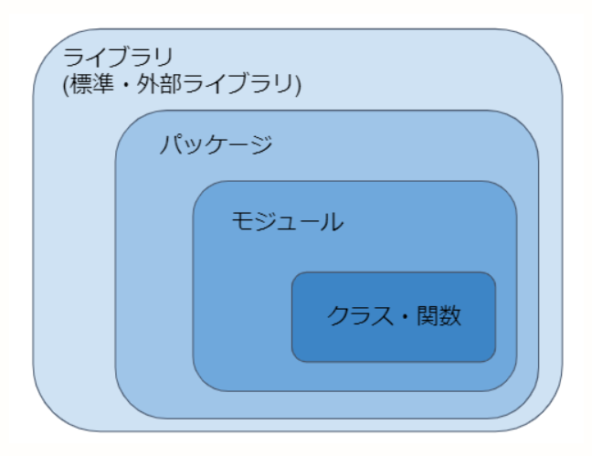

# Go Moduleについて調べる
## 1. Golangにおけるモジュールとは
Golangのバージョン1.11以前にはモジュールという物はなかった。
バージョン1.11で初めてモジュールが紹介され、1.13でモジュール機能が完成された。
そして**バージョン1.16からGolangの基本仕様となった**。

## 2. バージョン1.10までのパッケージ管理方法
**GOPATHモード**と呼ばれる。
標準パッケージを除く全てのパッケージのコード管理とビルドを、環境変数`GOPATH`で指定されたディレクトリは以下で行うモードのことです。
パッケージの管理はリポジトリの最新リビジョン(ソフトウェアやハードウェアに対する細かな修正のこと)のみが対象になる。

具体的なコードを元に分かりやすく理解します。
```code:
$ go get golang.org/x/net/html
```
上のコマンドを実行すると、`$GOPATH/src`に`golang.org/x/net/html`というディレクトリが作成されます。これはhtmlパッケージに関連するデータが入るディレクトリです。

GOPATHのディレクトリに関しては[こちら](https://qiita.com/lamp7800/items/9a154e8e789261f87466)が分かりやすかったです。

($GOPATHが通ってるとして)入ったパッケージは、以下のようにgolangのソースファイルとしてインポートする事が可能になります

```go: import(GOPATH)
import "golang.org/x/net/html"
```

## 3. Go Moduleとは
GOPATHでのパッケージ管理の代わりに登場したのがモジュールです。
- ライブラリ、パッケージ、モジュールの違い

見た感じPythonでいうモジュールと変わりはなさそうです。

標準パッケージを除く全てのパッケージをモジュールとして管理するモードを**モジュールモード**と呼びます。
コード管理とビルドは任意のディレクトリで可能で、モジュールはリポジトリのバージョンタグ、またはリビジョンごとに管理される。


