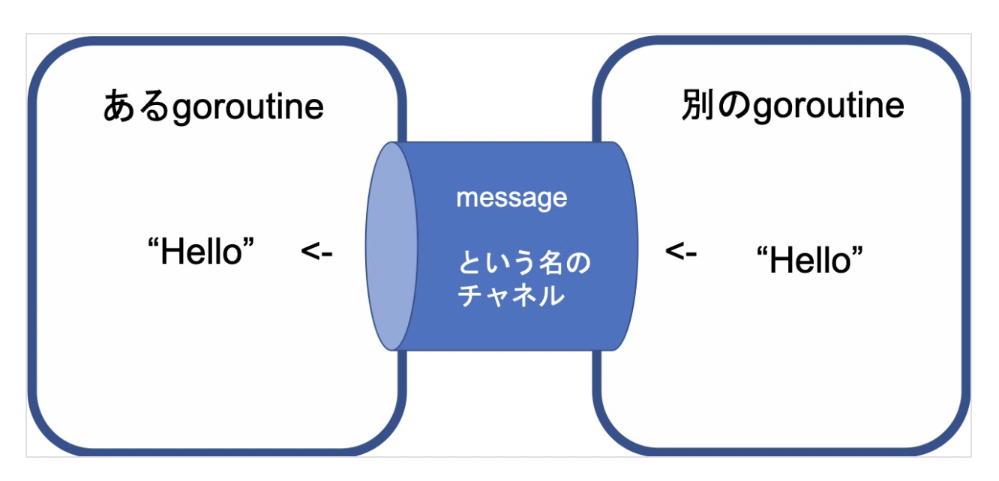

# A Tour of Go Concurrency
## 1. Goroutines
> goroutine(ゴルーチン)は、Goのランタイムに管理される軽量なスレッドです。

??
まず、スレッドの概念から...

#### 1-1. スレッドとは
- スレッド
  - 一連のプログラムの流れ

- シングルスレッド
  - 1つのスレッドだけからなるプログラム
- マルチスレッド
  - 1つのプログラムで複数のスレッドを同時に実行する

マルチスレッドは最強そうに見えるが、しっかり理解して使わないとパフォーマンスの低下やデッドロックを生じさせてしまう。
[マルチスレッドはどんな時に使うのか？](https://atmarkit.itmedia.co.jp/ait/articles/0503/12/news025.html)

#### 1-2. 一旦プログラムの流れを見てみる
```go: Goroutines
package main

import (
	"fmt"
	"time"
)

func say(s string) {
	for i := 0; i < 5; i++ {
    /* 1mm秒*100待ってから`s`を出力する */
		time.Sleep(100 * time.Millisecond)
		fmt.Println(s)
	}
}

func main() {
	go say("world")
	say("hello")
}

/* 実行結果 */
/*
world
hello
hello
world
world
hello
hello
world
world
hello
*/
```
上記のように、出力が混ざった状態になる。

#### 1-3. なぜこうなるか？
これは、**処理を並列で実行している**ことによってこうなっています。並列実行しているのは`say`関数2つです。

簡単に言うと、**関数名の前に`go`を付けるだけで並列実行出来る！**ということです。

## 2. Channels
複数の`Goroutine`間のデータのやり取りをするために、`Channel`(チャネル)という仕組みが用意されている。
チャネルを利用することで、ゴルーチン間でデータの送受信が実行できる。

- Channelsイメージ


チャネルというトンネル、というよりバッファのイメージですね。(チャネルは一時的に記憶する場所: バッファとして使える)

#### 2-1. Channelsの基本と使い方
- 新しいチャネルの作成
  - `make(chan 型)`
  - 使う前に生成が必要(宣言)
  - 例: `ch := make(chan int)`

- チャネルへ値を送信する
  - `channel <- 構文`
  - 例: `ch <- v` (`v`をチャネル`ch`へ送信する)

- チャネルから値を受信する
  - `<-channel 構文`
  - 例: `v := <-ch` (`ch`から受信した変数を`v`へ割り当てる)

`<-` は、チャネルオペレータで、データが矢印の方向に流れていることを指している。

チャネルを利用したGoroutine間のやり取りは、送る側と受ける側が準備できるまで送受信はブロックされる。
これはGoのデフォルトの機能です。

このため、同期処理的なものを書かなくても良い。

```go: Channels
func main() {
  messages := make(chan string)
  go func() { massages <- "Hello" }()

  msg := <-messages
  fmt.Println(msg)
}

/* 実行結果 */
// Hello
```

## 3. Buffered Channels
先に言いましたが、チャネルはバッファとして使えます。
- バッファが詰まるとチャネルへの送信をブロックする
- バッファが空のときは、チャネルの受信をブロックする

```go: channel(buffer)
package main

import "fmt"

func main() {
    ch := make(chan int, 2)
    ch <- 1
    ch <- 2

    fmt.Println(<-ch)
    fmt.Println(<-ch)
}

/* 実行結果 */
// 1
// 2
```
これをデッドロックが起こるように書き換える。

```go: channel(deadlock)
package main

import "fmt"

func main() {
    ch := make(chan int, 2)
    ch <- 1
    ch <- 2
    ch <- 3

    fmt.Println(<-ch)
    fmt.Println(<-ch)
    fmt.Println(<-ch)
}

/* 実行結果 */
// fatal error: all goroutines are asleep - deadlock!
```
