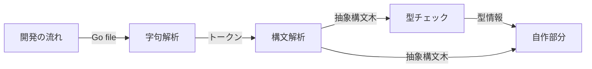
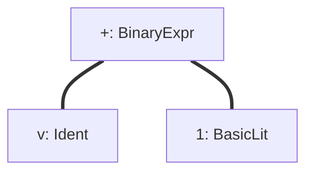
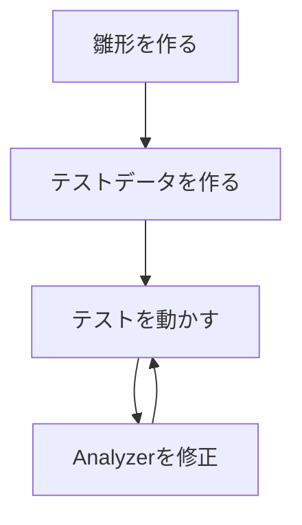

- [メルカリ作のプログラミング言語Go完全入門 読破](#メルカリ作のプログラミング言語go完全入門-読破)
- [14. 静的解析とコード生成](#14-静的解析とコード生成)
  - [14-1. 静的解析を行う理由](#14-1-静的解析を行う理由)
  - [14-2. 静的解析クイックスタート](#14-2-静的解析クイックスタート)
  - [14-3. 構文解析](#14-3-構文解析)
  - [14-4. 型チェック](#14-4-型チェック)
  - [14-5. コード生成](#14-5-コード生成)
  - [14-6. 静的単一代入(SSA)形式](#14-6-静的単一代入ssa形式)
  - [14-7. パッケージ情報の取得](#14-7-パッケージ情報の取得)
  - [14-8. go/analysis詳細](#14-8-goanalysis詳細)
  - [14-9. コールグラフとポインタ解析](#14-9-コールグラフとポインタ解析)
# メルカリ作のプログラミング言語Go完全入門 読破
# 14. 静的解析とコード生成
## 14-1. 静的解析を行う理由
- 静的解析をする理由
  - コンパイル前にバグを見つけることができる
    - デプロイ->リリースと進むにつれ、バグが深刻化してしまうので、早期発見、対処が重要
  - ソースコードとして解析する
  - ルールをチェックする
  - チェックを自動化する
    - 人の手でチェックしない

- 静的解析
  - プログラムを実行せずに解析する
- 動的解析
  - プログラムを実行して解析する

- 検索
  - grep
    - 文字列を検索できる、文字列のみ
    - 関数を探したりできない
    - そのために静的解析を用いて検索する

- Goでよく使われる静的解析ツール
  - https://docs.google.com/presentation/d/1I4pHnzV2dFOMbRcpA-XD0TaLcX6PBKpls6WxGHoMjOg/edit#slide=id.g870cb4ff5f_0_307
  - go testで検出
  - PRレビューで検出

## 14-2. 静的解析クイックスタート
- 静的解析ツールを自作する理由
  - プロジェクト毎のルールに合わせられる
  - 特定のライブラリの使い方を検証する
  - 自分が行いたい静的解析ツールがない



- goパッケージ
https://docs.google.com/presentation/d/1I4pHnzV2dFOMbRcpA-XD0TaLcX6PBKpls6WxGHoMjOg/edit#slide=id.g870cb4ff5f_0_712

- x/tools/goパッケージ
https://docs.google.com/presentation/d/1I4pHnzV2dFOMbRcpA-XD0TaLcX6PBKpls6WxGHoMjOg/edit#slide=id.g870cb4ff5f_0_718

- goパッケージはコンパイラでは使われない
  - あくまで静的解析用のパッケージ

- 静的解析はいくつかのフェーズに分かれている
1. 構文解析
2. 型チェック
3. 静的単一代入形式
4. ポインタ解析
  - 後のフェーズになるにつれ、詳しい情報が手に入る
  - 各フェーズで手に入る情報の使い分け、紐付けが重要
    - このノードの型情報は？など

- 字句解析
  - `v + 1`
    - v -> IDENT(identityの略、型変数を意味する)
    - + -> ADD
    - 1 -> INT
  - 上の3つは**トークン**と呼ぶ
    - トークンとして分解したとも言える。

- 構文解析
  - トークンを抽象構文木(AST: Abstract Syntax Tree)に変換
  - 2分木のようなTree構造



- 構文解析で分からないこと
  - 型情報
  - 定数式の結果
  - 識別子の解決
方が合わなくても文法状は問題ことを意味する

- 型チェック
  - 型情報を抽象構文木から抽出
  - 構文解析でできないことを行う(=構文解析で分からないことが分かる)
    - 定数の評価
      - ` n := 100 + 200` -> 100+200が300になることを評価する
    - 識別子の解決
      1. ` n := 100 + 200`
      2. `m := n + 300`
      3. 2のnがどこのnかを解決する(=1のn)
    - 型の推論
      1. ` n := 100 + 200`
      2. `m := n + 300`
      3. 2のnがintであることを推論する

- 静的解析ツールのモジュール化
https://docs.google.com/presentation/d/1I4pHnzV2dFOMbRcpA-XD0TaLcX6PBKpls6WxGHoMjOg/edit#slide=id.g870cb4ff5f_0_777

- go/analysisを使う利点
  - 共通部分は自動で行われる
    - 構文解析->型チェックまでは自動で行われる
    - パッケージ名からソースコード群を見つけるなども自動
  - モジュール化されているので使い回しができる

- go/analysisの構成要素
  - analysis.Analyzer
    - go/analysisの静的解析の1つの単位を表す構造体
      - Runフィールドに処理の本体を書く
      - Requiresに依存するAnalyzerを書く
  - analysis.Pass
    - 静的解析に使う情報の入った構造体
      - Analyzer.Runフィールドの引数で用いられる
  - analysis.Diagnostic
    - token.Pos(位置)に関連付けられた静的解析結果
      - 任意の位置へのエラーを表現するために使う
        - 例: n行目に、hogeというエラーがあります。

- analysistestパッケージ
  - Analyzerのテストを簡単に行うためのパッケージ

- skelton
  - go/analysis用のスケルトンコードジェネレータ
  - https://github.com/gostaticanalysis/skeleton
  - 簡単に静的解析ツールを始めることができる
    - 思い立ったらすぐ作れる
    - 簡単なら1時間で！

- skeltonを使った開発の流れ
  - テスト駆動開発で作れる



- skeltonのインストール
  - `$ go get -u github.com/gostaticanalysis/skeleton/v2`
  - Go1.16以上
    - `$ go install github.com/gostaticanalysis/skeleton/v2@latest`

- Goの静的解析に関するリポジトリを集めたもの
  - https://github.com/gostaticanalysis

## 14-3. 構文解析
抽象構文木を扱うためにはGoの構文に詳しくなる必要がある。
https://go.dev/ref/spec

抽象構文木の取得にはgo/parserパッケージを用いる
go/analysisパッケージが自動で行う

- 手動で構文解析を行いたい時
  - 式単位でパースしたい
  - 1ファイルだけパースしたい
  - コード生成やgo/analysisパッケージが使えない

- token.Pos型
  - ファイル上の位置を表す
```go:
// tokenパッケージにおける定義
type Pos int
const NoPos Pos = 0
```

- token.Fileset型
  - ファイル毎の位置情報を管理する

- 式単位の構文解析
  - parser.ParseExpr関数
  - parser.ParseExprFrom関数

- ファイル単位の構文解析
  - parser.ParseFile関数

- ディレクトリ単位の構文解析
  - parser.ParseDir関数

- 抽象構文木の走査
  - ast.Inspect関数
`v + 1`の1つずつの型名が出力できる。(ノード探索順？)
```go:
package main

import (
	"fmt"
	"go/ast"
	"go/parser"
)

func main() {
	n, err := parser.ParseExpr(`v + 1`)
	if err != nil { /* エラー処理 */
	}
	ast.Inspect(n, func(n ast.Node) bool {
		if n != nil {
			// 型名を出力
			fmt.Printf("%T\n", n)
		}
		// falseを返すと子ノードの探索をしない
		return true
	})
}

/* 実行結果 */
/*
*ast.BinaryExpr
*ast.Ident
*ast.BasicLit
*/
```

- 抽象構文木の走査
  - 探索アルゴリズムの切り替え
    - ast.Walk
  - フィルターをかけて探索
    - x/tools/go/ast/inspectorパッケージ -> Preorder
  - 探索のゆき・かえりのハンドリング
    - x/tools/go/ast/inspectorパッケージ -> Nodes
  - 親ノードの取得
    - x/tools/go/ast/inspectorパッケージ -> WithStack

- ノードの置換や挿入
  - x/tools/go/ast/astutil.Apply関数 -> astutil.Cursor(置換)
- ノードのある行数などを取得
  - (*token.FileSet).Positionメソッド -> token.Position型の値の取得
- ノードに対応するコメントの取得
  - ast.CommentMap型

- 抽象構文木からソースコードを生成
  - go/formatNode関数
`v+1`の構文解析 -> ソースコードの生成？
```go:
package main

import (
	"bytes"
	"fmt"
	"go/format"
	"go/parser"
	"go/token"
)

func main() {
	expr, err := parser.ParseExpr(`v+1`)
	if err != nil {
		panic(err)
	}
	fset := token.NewFileSet()
	var buf bytes.Buffer
	err = format.Node(&buf, fset, expr)
	if err != nil {
		panic(err)
	}
	// v + 1
	fmt.Println(buf.String())
}
```

## 14-4. 型チェック
型情報を抽象構文木から抽出

## 14-5. コード生成
- ソースコードをプログラムによって生成する
  - 冗長なコードの自動生成
  - テストコードの生成
  - 静的解析の解析結果やデータベースのスキーマなどから生成

- コード生成の必要性
  - Goにはジェネリクスがない
    - Go1.18から登場によって変わる？
  - 冗長なコードの自動生成
    - 可読性が低いがパフォーマンスが良いコードが生成できる

- コード生成と静的解析
  - 静的解析した結果を元に、コードを生成する
    - 型、構造体タグ、コメントを解析

- コード生成されたコードにはそれを伝えるコメントをつける
  - `// Code generated by xxxxx; DO NOT EDIT.`
    - `package main`の前に付ける
  - 手動で変更しないことを促す
  - スケルトンコードなど、変更される前提の場合はつけない

- コード生成元
  - テンプレート
    - text/template
  - 抽象構文木
    - 構築 -> astutil.Apply
    - フォーマット -> go/format.Node

- コード生成の難しさ
  - 静的解析の知識が必要
  - analysis.Analyzerのようなエコシステムがない
    - 再利用性がない
    - 簡単に始めにくい

- knife(ナイフ)
  - go listのように型情報を表示できるツール
  - テンプレートベースのコード生成

- hagane
  - テンプレートベースのコード生成を行うCLIツール

- codegenパッケージ
  - コード生成のエコシステムを提供

## 14-6. 静的単一代入(SSA)形式
- 変数への入力1回だけに制限した形式
  - 同じ変数に複数回代入できる例
    - `n := 10, n += 10`
  - 1回だけの場合(同じ変数は使いまわさない)
    - `n1 := 10, n2 := n1 +10`

- Web上でSSAを確認できるサイト
  - https://golang-ssaview.herokuapp.com/

- 静的単一代入形式で分かること
  - コントロールフローグラフ
    - 分岐や繰り返しの簡略化
    - 処理の前後関係を追いやすい
  - 単一の代入であることが保証されている
    - 同じ値に対する処理を見つけやすい

- 静的単一代入形式で分からないこと
  - 公開された変数への代入
    - 外部パッケージから変更される可能性がある
  - ポインタを介した変更
  - インタフェースを介した処理
  - リフレクションを介した動作

## 14-7. パッケージ情報の取得
- go listコマンド
  - Goのパッケージ情報などを表示するコマンド
    - `-f`: 表示する情報を変更
    - `-m`: モジュールの情報を表示
    - `-json`: JSON形式で出力
    - `go list -m -u -json all`
      - 全てのモジュールのアップデート情報を出す
    - 詳細は`go help list`で確認可能

- go/buildパッケージ
  - Goのパッケージ情報を集めるパッケージ

- Go Modules
  - 標準のモジュール管理の仕組み
  - modulesの特徴
    - ビルド時に依存関係を解決する(=go tool)
    - ベンダリングが不要に
    - 新しくモジュールという概念単位でバージョン管理する
      - (以前はGOPATH)
    - 互換性が亡くなる場合はインポートパスを変える
      - (明示的にバージョン指定など)
    - 可能な限り古いバージョンが優先される

## 14-8. go/analysis詳細
- ドライバー
  - 静的解析ツールを実行するプログラム
    - analysis.Analyzer型で定義したものが対象
    - unitcheckerパッケージを利用して作ったコマンドを実行する
    - 公式では`go vet`, `goplz`など

## 14-9. コールグラフとポインタ解析

