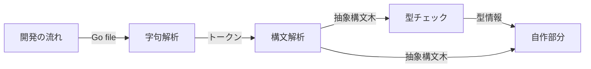
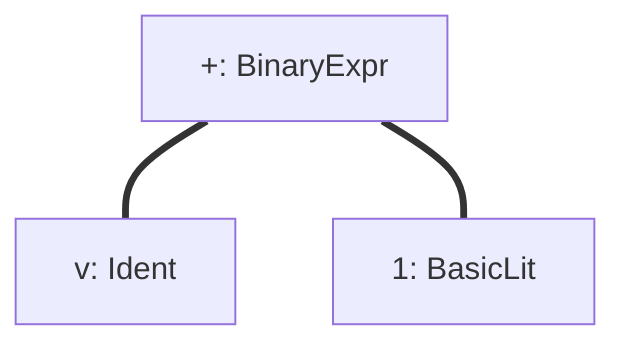

# メルカリ作のプログラミング言語Go完全入門 読破
# 14. 静的解析とコード生成
## 14-1. 静的解析を行う理由
- 静的解析をする理由
  - コンパイル前にバグを見つけることができる
    - デプロイ->リリースと進むにつれ、バグが深刻化してしまうので、早期発見、対処が重要
  - ソースコードとして解析する
  - ルールをチェックする
  - チェックを自動化する
    - 人の手でチェックしない

- 静的解析
  - プログラムを実行せずに解析する
- 動的解析
  - プログラムを実行して解析する

- 検索
  - grep
    - 文字列を検索できる、文字列のみ
    - 関数を探したりできない
    - そのために静的解析を用いて検索する

- Goでよく使われる静的解析ツール
  - https://docs.google.com/presentation/d/1I4pHnzV2dFOMbRcpA-XD0TaLcX6PBKpls6WxGHoMjOg/edit#slide=id.g870cb4ff5f_0_307
  - go testで検出
  - PRレビューで検出

## 14-2. 静的解析クイックスタート
- 静的解析ツールを自作する理由
  - プロジェクト毎のルールに合わせられる
  - 特定のライブラリの使い方を検証する
  - 自分が行いたい静的解析ツールがない

- goパッケージ
https://docs.google.com/presentation/d/1I4pHnzV2dFOMbRcpA-XD0TaLcX6PBKpls6WxGHoMjOg/edit#slide=id.g870cb4ff5f_0_712

- x/tools/goパッケージ
https://docs.google.com/presentation/d/1I4pHnzV2dFOMbRcpA-XD0TaLcX6PBKpls6WxGHoMjOg/edit#slide=id.g870cb4ff5f_0_718

- goパッケージはコンパイラでは使われない
  - あくまで静的解析用のパッケージ

- 静的解析はいくつかのフェーズに分かれている
1. 構文解析
2. 型チェック
3. 静的単一代入形式
4. ポインタ解析
  - 後のフェーズになるにつれ、詳しい情報が手に入る
  - 各フェーズで手に入る情報の使い分け、紐付けが重要
    - このノードの型情報は？など

- 字句解析
  - `v + 1`
    - v -> IDENT(identityの略、型変数を意味する)
    - + -> ADD
    - 1 -> INT
  - 上の3つは**トークン**と呼ぶ
    - トークンとして分解したとも言える。

- 構文解析
  - トークンを抽象構文木(AST: Abstract Syntax Tree)に変換
  - 2分木のようなTree構造

- 構文解析で分からないこと
  - 型情報
  - 定数式の結果
  - 識別子の解決
方が合わなくても文法状は問題ことを意味する

- 型チェック
  - 型情報を抽象構文木から抽出
  - 構文解析でできないことを行う(=構文解析で分からないことが分かる)
    - 定数の評価
      - ` n := 100 + 200` -> 100+200が300になることを評価する
    - 識別子の解決
      1. ` n := 100 + 200`
      2. `m := n + 300`
      3. 2のnがどこのnかを解決する(=1のn)
    - 型の推論
      1. ` n := 100 + 200`
      2. `m := n + 300`
      3. 2のnがintであることを推論する

- 静的解析ツールのモジュール化
https://docs.google.com/presentation/d/1I4pHnzV2dFOMbRcpA-XD0TaLcX6PBKpls6WxGHoMjOg/edit#slide=id.g870cb4ff5f_0_777

- go/analysisを使う利点
  - 共通部分は自動で行われる
    - 構文解析->型チェックまでは自動で行われる
    - パッケージ名からソースコード群を見つけるなども自動
  - モジュール化されているので使い回しができる

- go/analysisの構成要素
  - analysis.Analyzer
    - go/analysisの静的解析の1つの単位を表す構造体
      - Runフィールドに処理の本体を書く
      - Requiresに依存するAnalyzerを書く
  - analysis.Pass
    - 静的解析に使う情報の入った構造体
      - Analyzer.Runフィールドの引数で用いられる
  - analysis.Diagnostic
    - token.Pos(位置)に関連付けられた静的解析結果
      - 任意の位置へのエラーを表現するために使う
        - 例: n行目に、hogeというエラーがあります。

- analysistestパッケージ
  - Analyzerのテストを簡単に行うためのパッケージ
