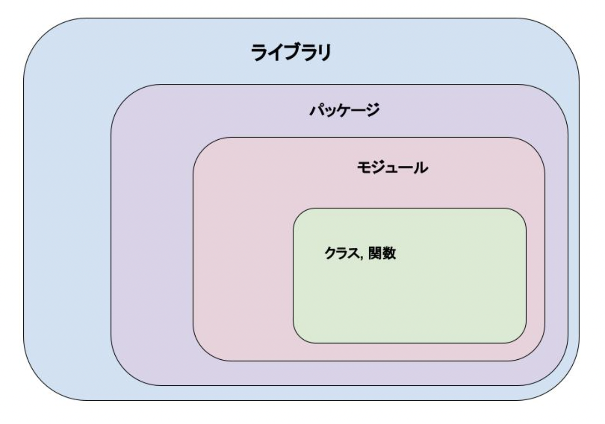
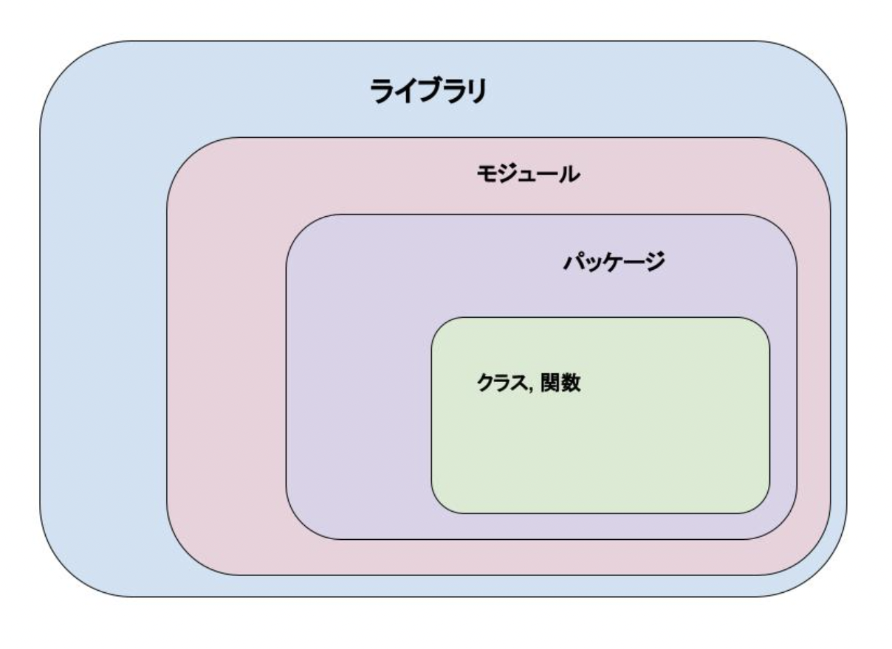

# Go Moduleについて調べる
参考: [Go Modules Reference - The Go Programming Language](https://go.dev/ref/mod#modules-overview)
自分が知っているモジュールというと以下のような位置関係(相関関係)です。

## 1. Golangにおけるモジュールとは
> A module is a collection of packages that are released, versioned, and distributed together.

これは、モジュールは、**パッケージの集まり**として扱われということを言っています。
これは以下のような相関関係です。(各言語によって扱いが違うようです。)

Golangのバージョン1.11以前にはモジュールという物はなかった。
バージョン1.11で初めてモジュールが紹介され、1.13でモジュール機能が完成された。
そして**バージョン1.16からGolangの基本仕様となった**。

バージョン1.10以前のパッケージ管理を"GOPATHモード"
バージョン1.11以降のパッケージ管理を"モジュールモード"
と呼びます。

#### 1-1. GOPATHモードの問題点
GOPATHモードは、いろいろなプロジェクトのコードを全て`GOPATH`以下で管理していたため、
- ソースコードを好きな場所に置けなかった
- プロジェクト毎に異なるバージョンのパッケージを使う事ができなかった(GOPATH汚染問題と呼ばれたらしい)

これを解消するために"モジュールモード"が導入されました。

#### 1-2. GOPATHモードとモジュールモードの違い
- バージョン
GOPATHモード -> 1.10以前
モジュールモード -> **1.17**からは常にコレ！！

- コード、ビルドの管理場所
GOPATHモード -> 指定された場所のみ
モジュールモード -> 任意の場所で可能

- パッケージの使用
GOPATHモード -> 最新バージョンのみ
モジュールモード -> バージョン指定して使える

- 共通点
バイナリはどちらも`GOPATH`下に入る。

#### 1-3. モードの切り替え
- 環境変数`GO111MODULE`でモードを切り替えられる
`GO111MODULE=on` -> 常にモジュール対応モード
`GO111MODULE=off` -> 常にGOPATHモード

**Go1.17以降は`GO111MODULE=on`がデフォルト値だから基本的には気にしなくて良い。**

## 2. モジュール
"GOPATHモード"は使おうと思わないと使わないという事がわかりましたので、"モジュールモード"、というよりは"モジュール"に関して調査していきます。

> A module is identified by a module path, which is declared in a go.mod file, together with information about the module’s dependencies. The module root directory is the directory that contains the go.mod file. The main module is the module containing the directory where the go command is invoked.

モジュールは、**モジュールパスで識別され、モジュールの依存関係の情報とともに`go.mod`ファイルで宣言される**、と書かれています。
