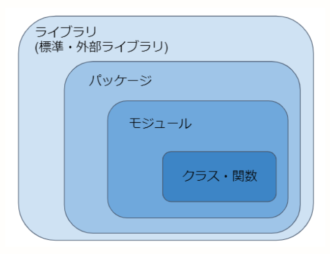

# Go Moduleについて調べる
- ライブラリ、パッケージ、モジュールの違い

見た感じPythonでいうモジュールと変わりはなさそうです。

## 1. Golangにおけるモジュールとは
Golangのバージョン1.11以前にはモジュールという物はなかった。
バージョン1.11で初めてモジュールが紹介され、1.13でモジュール機能が完成された。
そして**バージョン1.16からGolangの基本仕様となった**。

バージョン1.10以前のパッケージ管理を"GOPATHモード"
バージョン1.11以降のパッケージ管理を"モジュールモード"
と呼びます。
#### 1-3. モジュール対応モード(modhule-aware mode)
GOPATHでのパッケージ管理の代わりに登場したのがモジュールモードです。

標準パッケージを除く全てのパッケージをモジュールとして管理するモードを**モジュールモード**と呼びます。
コード管理とビルドは任意のディレクトリで可能で、モジュールはリポジトリのバージョンタグ、またはリビジョンごとに管理される。

## 
