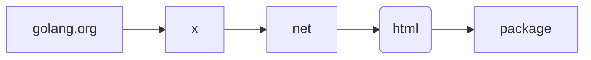
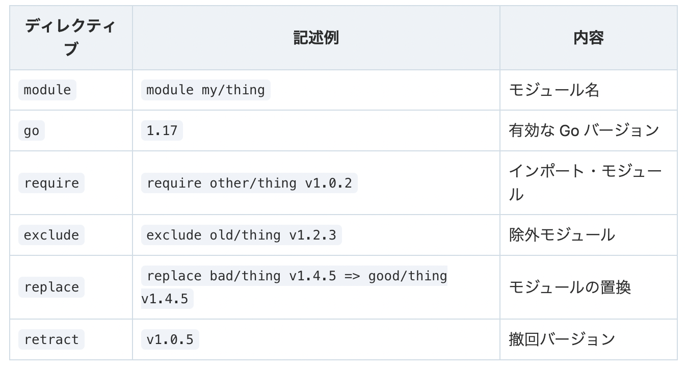

# Go Moduleについて調べる
自分が知っているモジュールというと以下のような位置関係(相関関係)です。

## 1. Golangにおけるモジュールとは
> A module is a collection of packages that are released, versioned, and distributed together.

[引用](https://go.dev/ref/mod#modules-overview)

これは、モジュールは、**パッケージの集まり**として扱われということを言っています。
これは以下のような相関関係です。(各言語によって扱いが違うようです。)


Golangのバージョン1.11以前にはモジュールという物はなかった。
バージョン1.11で初めてモジュールが紹介され、1.13でモジュール機能が完成された。
そして**バージョン1.16からGolangの基本仕様となった**。

バージョン1.10以前のパッケージ管理を"GOPATHモード"
バージョン1.11以降のパッケージ管理を"モジュールモード"
と呼びます。

#### 1-1. GOPATHモードの問題点
GOPATHモードは、いろいろなプロジェクトのコードを全て`GOPATH`以下で管理していたため、
- ソースコードを好きな場所に置けなかった
- プロジェクト毎に異なるバージョンのパッケージを使う事ができなかった(GOPATH汚染問題と呼ばれたらしい)

これを解消するために"モジュールモード"が導入されました。

#### 1-2. GOPATHモードとモジュールモードの違い
- バージョン
GOPATHモード -> 1.10以前
モジュールモード -> **1.17**からは常にコレ！！

- コード、ビルドの管理場所
GOPATHモード -> 指定された場所のみ
モジュールモード -> 任意の場所で可能

- パッケージの使用
GOPATHモード -> 最新バージョンのみ
モジュールモード -> バージョン指定して使える

- 共通点
バイナリはどちらも`GOPATH`下に入る。

#### 1-3. モードの切り替え
- 環境変数`GO111MODULE`でモードを切り替えられる
`GO111MODULE=on` -> 常にモジュール対応モード
`GO111MODULE=off` -> 常にGOPATHモード

**Go1.17以降は`GO111MODULE=on`がデフォルト値だから基本的には気にしなくて良い。**

## 2. モジュール
"GOPATHモード"は使おうと思わないと使わないという事がわかりましたので、"モジュールモード"、というよりは"モジュール"に関して調査していきます。

2章とその節、および3章では、[Go Modules Reference - The Go Programming Language](https://go.dev/ref/mod#modules-overview)を引用しながら理解を深めます。(個人的に言語化していますので意訳という意味で書きます。)

> A module is a collection of packages that are released, versioned, and distributed together.

冒頭でも引用しましたが、
1. モジュールは、**パッケージの集合体**であること。
2. パッケージはバージョン管理されている。

と書かれています。
まずは、パッケージを理解する必要があるようです。

#### 2-1. Go: パッケージ
> Each package within a module is a collection of source files in the same directory that are compiled together.

- パッケージは、**ソースファイルの集合体**である。
と書かれています。

つまりパッケージは、**1つ以上のGoソースファイル(または他のGoパッケージ)を含むGoワークスペース内のディレクトリのこと**を言っています。

#### 2-2. Go: モジュール
パッケージがなんであるか分かった所で再度モジュールに戻ります。

> Modules may be downloaded directly from version control repositories or from module proxy servers.

- モジュールはバージョン管理リポジトリ、またはモジュールプロキシサーバーからダウンロード出来る。

> A module is identified by a module path, which is declared in a go.mod file, together with information about the module’s dependencies. The module root directory is the directory that contains the go.mod file. The main module is the module containing the directory where the go command is invoked.

- モジュールは、**モジュールパスで識別され、モジュールの依存関係の情報とともに`go.mod`ファイルで宣言される**
- モジュールは、`go.mod`ファイルのあるディレクトリ以下の全てのパッケージのことを指している。
(**`go.mod`はモジュールを管理するファイルなので、モジュールには含まれない**。)

> A package path is the module path joined with the subdirectory containing the package (relative to the module root). For example, the module "golang.org/x/net" contains a package in the directory "html". That package’s path is "golang.org/x/net/html".

- パッケージのパスは、モジュールのパスと、パッケージを含むサブディレクトリを足したものである。
**(モジュールルート、つまりディレクトリ内のルートからの相対パスを指しています。)**

- 例えば、モジュール"golang.org/x/net"には"html"という名前のディレクトリがあり、その中にパッケージを含んでいます。この場合のパッケージパスは、「golang.org/x/net/html」となります。



## 3. モジュールパス
> A module path is the canonical name for a module, declared with the module directive in the module’s go.mod file. A module’s path is the prefix for package paths within the module.

- モジュールパスとは、`go.mod`の"goディレクティブ"で宣言された**モジュールの正式名称**
※`go.mod`の中に"goディレクティブ"と呼ばれるgoのバージョンを指定する項目がある。
- モジュールのパスは、そのモジュール内のパッケージパスのプレフィックスとなる。
例でもありましたが、パッケージパス`golang.org/x/net/html`の"golang.org/x/net"がモジュールパスに当たります。
(htmlディレクトリの中のパッケージを示す時は、htmlまでのルートからのパスをプレフィックス(接頭辞)として付けると解釈して良さそうです。)

> A module path should describe both what the module does and where to find it. Typically, a module path consists of a repository root path, a directory within the repository (usually empty), and a major version suffix (only for major version 2 or higher).

- モジュールパスは、**モジュールが何をするのか、どこにあるのかを記述する必要がある**。
- モジュールパスの構成は、リポジトリのルートパス、リポジトリ内のディレクトリ(通常は空)、メジャーバージョンサフィックスである。

ここは例を挙げながら理解します。
参考: [Go のモジュール管理【バージョン 1.17 改訂版】](https://zenn.dev/spiegel/articles/20210223-go-module-aware-mode)

- 外部パッケージ"github.com/goark/pa-api/entity"をインポートする場合
```go:
import "github.com/goark/pa-api/entity"
```
この時のモジュール対応モードの処理を追います。
> 1. 宣言された`import "github.com/goark/pa-api/entity"`を解釈して、`https://github.com/goark/pa-api`にあるリポジトリの指定りビジョンをフェッチする。(りビジョンは自パッケージの`go.mod`ファイルで指定されたバージョンから類推する)

> 2. フェッチしたリポジトリにある`go.mod`ファイルからモジュール名`github.com/goark/pa-api`を取得する。(`go.mod`ファイルがない場合は物理パスがそのままモジュール名となる)

> 3. 宣言されたパスとモジュール名からサブディレクトリ`entity`を該当のパッケージと解釈してインポートする。

上記の例から考えます。
> モジュールパスは、**モジュールが何をするのか、どこにあるのかを記述する必要がある**。

これは、モジュール名`github.com/goark/pa-api`は、
1. "github.com" -> http://github.comにある
2. "goark/pa-api" -> golang用で、Amazon PA-APIv5にアクセスするためのもの
と、モジュール名を見ただけで推察できることが分かります。

> モジュールパスの構成は、リポジトリのルートパス、リポジトリ内のディレクトリ(通常は空)、メジャーバージョンサフィックスである。

メジャーバージョンサフィックスである、という所だけが良く分かりませんね。
参考: [Go modulesで依存モジュールのメジャーバージョンがv2以上の時の対応](https://christina04.hatenablog.com/entry/go-modules-major-version)
ポイントとしては、
1. go modules(モジュールのシステム、アルゴリズム)は、複数依存モジュールがあった場合に、**より新しいバージョンを使おうとする**。
2. 使おうとしたモジュールに後方互換性がなかった場合、期待する動作が得られない場合がある。
3. 複数の依存モジュール間で互換性を持たせるかどうか(互換性が必要かどうか)を書く事で期待した通りの動作を得られるようにするということ。

> "If an old package and a new package have the same import path, the new package must be backwards compatible with the old package."

この基準は、同じ"import path"なら互換性を保つ、互換性を保たないなら別の"import path"にする、という事です。
引用: [Semantic Import Versioning](https://research.swtch.com/vgo-import)

## 4. モジュールの管理
**モジュールの管理は`go.mod`および`go.sum`という名前のファイルで行う**。
参考: [Go のモジュール管理【バージョン 1.17 改訂版】](https://zenn.dev/spiegel/articles/20210223-go-module-aware-mode)

#### 4-1. go.mod
- `go.mod`の中身
```go: go.mod
module github.com/goark/pa-api

go 1.17
```
この"module", "go"と呼ばれるのは、モジュールで取り上げましたが、"**ディレクティブ(directive)**と呼ばれるものです。
例えば、"module"ディレクティブは、モジュール名を定義する。
`1.17`から、"go"ディレクティブ未定時の規定値が`1.11`とみなされるようになった。



#### 4-2. go.sum
`go.sum`とは何なのか？というのを調べていきます。

`go.sum`には、インポートするモジュールの"SHA-256 チェックサム値"というものが格納されている。

SHA-256は、どんな長さの原文からも256ビットのハッシュ値を算出することができるハッシュ関数の1つ。
チェックサム値は、ファイルの"同一性"を確認するもの。

> A module may have a text file named go.sum in its root directory, alongside its go.mod file. The go.sum file contains cryptographic hashes of the module’s direct and indirect dependencies. When the go command downloads a module .mod or .zip file into the module cache, it computes a hash and checks that the hash matches the corresponding hash in the main module’s go.sum file. go.sum may be empty or absent if the module has no dependencies or if all dependencies are replaced with local directories using replace directives.

> The checksum database is a global source of go.sum lines. The go command can use this in many situations to detect misbehavior by proxies or origin servers.

> The checksum database is served by sum.golang.org, which is run by Google. It is a Transparent Log (or “Merkle Tree”) of go.sum line hashes, which is backed by Trillian. The main advantage of a Merkle tree is that independent auditors can verify that it hasn’t been tampered with, so it is more trustworthy than a simple database.

[引用](https://go.dev/ref/mod#modules-overview)

ちょっと長いですね...
ポイントとなる部分と上記の"SHA-256 チェックサム値"とを統合し、`go.sum`が何であるかをまとめます。
1. `go`コマンド時に`go.mod`のハッシュを計算し、`go.sum`に書かれているハッシュ(SHA-256)と一致するかをチェックする(チェックサム値)。
2. `go.sum`に書かれているのは"チェックサムデータベース"というもので、Googleから提供されていて信頼性が高い。

この仕組みは外部パッケージの使用などに起因していると思われます。
モジュールの取得自体は"`go.mod`の`require`ディレクティブにある情報で完結できる"ため、`go.sum`自体は無くてもビルド再現性は得られるようです。
パブリックなリポジトリやGitHub(アカウント)が悪意のある第三者に悪用された場合の確認手段、という意味合いが強いと思われます。

## 5. Go Module まとめ

