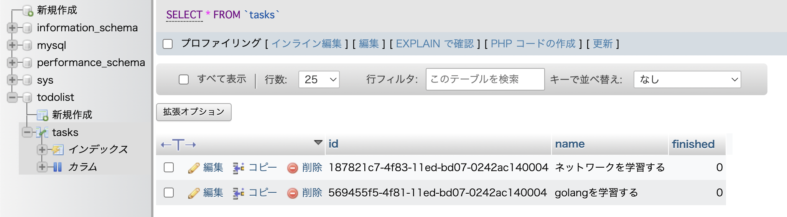

- [golang TODO Application](#golang-todo-application)
  - [1. 要件定義](#1-要件定義)
  - [2. Web APIの仕様選定](#2-web-apiの仕様選定)
  - [3. Postman](#3-postman)
  - [4. GETメソッドを実装後](#4-getメソッドを実装後)
  - [5. 残りの実装](#5-残りの実装)
    - [5-1. POSTメソッドの実装と確認](#5-1-postメソッドの実装と確認)
    - [5-2. phpMyAdmin](#5-2-phpmyadmin)
    - [5-3. PUT, DELETEメソッドの実装と確認](#5-3-put-deleteメソッドの実装と確認)
# golang TODO Application

## 1. 要件定義

* TODOアプリケーションに必要な要件定義
1. タスクは番号で管理する。
2. タスクには名前を付けられる。
3. タスクが終わったかどうかをチェックできる。

| TODOの要件定義 | タスク番号 | タスク名         | 終わったかどうか |
| --------- | ----- | ------------ | -------- |
| テーブルの列名   | id    | name         | finished |
| 列の型       | uuid型(16進数32桁) | 文字列型(string) |  ブール型(boolean)        |

* 完成イメージ

| id(uuid) | name | finished    |
| -------- | ---- | --- |
| 93b7cb6a         |  golangを勉強する    |  [ ]   |
| 93cac93b        |  技術記事を書く    |  [X]   |

## 2. Web APIの仕様選定

* GET `/tasks`
  + **全てのタスク一覧を、サーバのDBから取得する**

* POST `/tasks`
  + **タスクをサーバのDBに追加する**
  + JSONデータで送る。
  + `"name": "golangを勉強する"`
  + idは自動で振られるようにする。

* PUT `/tasks/:id`
  + **idを指定して、サーバのDBのタスクを完了にする**
  + 例えば、`PUT tasks/93b7cb6a`のようにリクエストする。

* DELETE `tasks/:id`
  + **idを指定して、サーバのDBのタスクを削除する**
  + 例えば、`DELETE tasks/93b7cb6a`のようにリクエストする。

## 3. Postman

[Postman](https://www.postman.com/downloads/)でAPIを叩けるようにしておく。

## 4. GETメソッドを実装後

 `e.GET("/api/tasks", GetTaskHandler)`

1. `docker compose up -d --build`
2. serverコンテナ内に入る
起動しているコンテナに入る場合は `docker compose exec` を使う
 `docker compose exec server sh `

3. `go run main.go`

```shell:
   ____    __
  / __/___/ /  ___
 / _// __/ _ \/ _ \
/___/\__/_//_/\___/ v4.9.0
High performance, minimalist Go web framework
https://echo.labstack.com
____________________________________O/_______

                                    O\

⇨ http server started on [::]:8000

```

4. POSTMANでAPIを叩く
GETメソッド: `http://localhost:8000/api/tasks` -> send
ターミナルに表示: `2022-10-19T10:28:29.639749756+09:00 localhost:8000 GET /api/tasks 200`

POSTMANに表示: [] (DBが空なので正常)
DBにタスク追加後はjsonで返ってくる予定。

5. ここまでの確認

* データベース設定と、ルーティングの設定
* goファイルを書いて、タスク一覧を取得するAPIを実装
* Dockerを起動して、正常に動作するか確認した

## 5. 残りの実装

1. ToDoリストの完成(CUD)
2. 起動し、正常に動くかの確認

### 5-1. POSTメソッドの実装と確認

 `e.POST("/api/tasks", AddTaskHandler)`

1. コンテナの起動: `docker compose up -d --build`
2. コンテナに入る: `docker compose exec server sh`
3. POSTMANを開く
   1. POSTメソッド
   2. `http://localhost:8000/api/tasks`
   3. body -> raw -> JSON
   4. { "name": "golangを学習する" }
   5. send
6. 結果

- POSTMANログ

```json:
{
    "ID": "569455f5-4f81-11ed-bd07-0242ac140004",
    "Name": "golangを学習する",
    "Finished": false
}
```

* 標準出力
 `2022-10-19T16:40:44.038614676+09:00 localhost:8000 POST /api/tasks 200`

無事にPOST出来ている。

* curlでもPOSTしてみる

```shell:
curl -X POST -H "Content-Type: application/json" -d '{"name": "ネットワークを学習する"}' localhost:8000/api/tasks

{"ID":"187821c7-4f83-11ed-bd07-0242ac140004", "Name":"ネットワークを学習する", "Finished":false}
```

### 5-2. phpMyAdmin

`localhost:4040` で起動。
todolist -> tasksでPOST出来ているのが確認出来た。



### 5-3. PUT, DELETEメソッドの実装と確認

* PUT
 `e.PUT("/api/tasks/:taskID", ChangeFinishedTaskHandler)`

[GORM CRUD: レコードの更新](https://gorm.io/ja_JP/docs/update.html)

* DELETE
 `e.DELETE("/api/tasks/:taskID", DeleteTaskHandler)`
