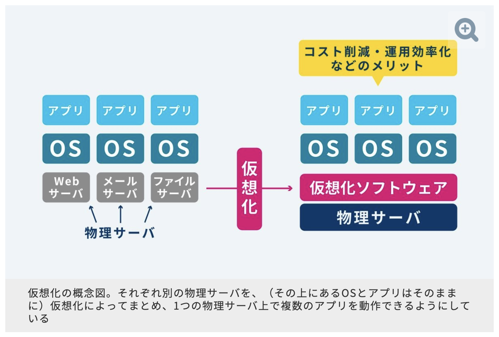
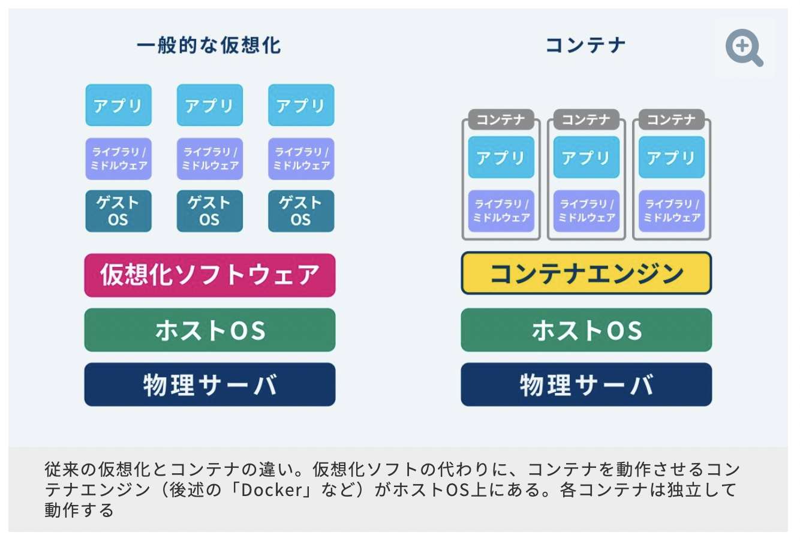

# コンテナって何？Dockerとバーチャルマシンの違いは何？
- Agenda
1. コンテナとは？
2. Dockerとは？
3. バーチャルマシンとは？
4. Dockerとバーチャルマシンの違いとは？
5. まとめ

## 1. コンテナとは
- 実行可能なイメージの実体(instance)
Docker APIやCLIを使ってコンテナの作成、開始、停止、移動、削除ができる。
- ローカルマシン上や、仮想マシン上でも実行でき、クラウドにもデプロイできる。
- 可搬性(portability)がある。(多くのOSで実行可能)
- コンテナはお互いに隔離され、それぞれが自身のソフトウェア、バイナリ、設定を使って実行する。

参考: [コンテナとは何？](https://docs.docker.jp/get-started/index.html#id5)

#### 1-1. コンテナが誕生した背景
ここ近年のIT技術の急発展と動かすサーバー機器の激増が大きな要因です。
サーバーの持ち運ぶ手間、管理などの作業全般のスピードと解消が求められました。そこで仮想化技術が誕生し、発展してきました。
その技術発展の流れでコンテナ技術も生まれました。

#### 1-2. コンテナ技術のメリット
冒頭でコンテナの特徴を押さえましたが、従来のサーバーと違い、どういった利点があるのでしょうか。
求めらて生まれたコンテナ技術ですから、そこに起因したメリットが多数あります。

- ITの資源(機器など)を有効活用できる
  - 仮想ですから持ち運びの手間の必要もありません
- 多数のサーバーを同時に管理する手間が減る
- アプリ開発作業が捗る(開発から本番環境への移行がしやすいなど)
- 起動と動作が軽快で、ストレスを抑え、仕事が進む

#### 1-3. コンテナ技術のデメリット
メリットが目立ちますが、デメリットも存在します。
ただし優先度の高いものから少しずつ改善されています。

- 基本的なサーバー設定方法以外にコンテナ技術に対しての学習時間が必要となる
- 土台となるOSとは別のOSを、コンテナとして稼働できない。
- ぱっと見て分からないことが多い(コマンド操作が多い)
- 構築、設定や操作がとにかく複雑なイメージがある

#### 1-4. そもそも仮想環境とは？

例えば:
1. MacOSの中でWindowsを起動させてWindows専用アプリを作るなど、**使っているPCのOSとは別のOSを使う用途**
2. 特定のアプリだけが動いているようにするためにウィルス対策ソフトなどの常駐アプリがない環境を作ったりなど、**不具合の多いアプリを使用中のOSから確率する用途**
などが挙げられます。

- 仮想環境の用途として最も重要なこと
**"安全で効率的なアプリの開発や運用"**です。

ローカルの環境は人それぞれ違います。
仮想環境を行うことでチームメンバーの環境を揃えられる事のメリットはとても大きいです。(自分もハッカソンで自分は動くけど他の人が動かないとなった時に仮想環境で環境を揃えました。)
また、1つのサーバやPC上に用途に応じて自由にアプリを開発できることもできます。

#### 1-5. 従来の仮想化とコンテナの違い
従来の仮想化では、1つの仮想環境の中に必要なものをOSから全て作ってしまう方式です。異なるOS環境を使いたい場合には有用だったが、実際の開発・運用では「OS周りは同じでいいのに」というケースが多かったようです。(いちいちOSまで作ってしまうのはリソースの無駄になる)。そこで誕生したのが**コンテナ**です。

従来の仮想化ソフトウェアの代わりにコンテナエンジン(Dockerのこと)がホストOS上にあります。
最大の特徴は、その上にコンテナがあり、**ゲストOSを必要としないこと**、**各コンテナは独立して動作すること**です。

#### 1-4. コンテナのまとめ
- メリットが多いが、使いこなすまでにはある程度の学習コストが必要
コンテナ技術を使いこなすには、基本的なサーバー設定方法以外にコマンド操作やネットワークに関する知識などを学ばなければなりません。
#### 1-5. DockerとVirtul Machin
仮想マシンである"Virtual Machine"と比較しないとコンテナ技術のメリットを全て抑えることはできません。
事項からコンテナ技術であるDockerとVirtualMachinを学び、比較検討したいと思います。

## 2. Docker
#### 2-1. Dockerの概要
Dockerは、Docker社が開発したコンテナという概念を管理する**ソフトウェア**で、サーバを起動する方法がシンプルで、かつ起動や処理が速いことが特徴。
